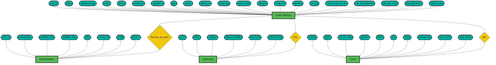

```mermaid
graph TD
    %% Entities
    USER_PROFILE[USER_PROFILE]
    CONSULTANTS[CONSULTANTS]
    EXERCISE[EXERCISE]
    FOOD[FOOD]

    %% Relationships
    RECEIVES_AS_EXPERT{Receives_as_expert}
    DOES{Does}
    EATS{Eats}

    %% Attributes (Ovals)
    A1(["user_id"])
    A2(["email"])
    A3(["password_hash"])
    A4(["name"])
    A5(["phone"])
    A6(["created_at"])
    A7(["updated_at"])
    A8(["age"])
    A9(["gender"])
    A10(["height_cm"])
    A11(["weight_kg"])
    A12(["activity_level"])
    A13(["allergies"])
    A14(["meal_pref"])
    A15(["deadline"])
    A16(["aim_kg"])
    A17(["calories_req_per_day"])
    A18(["diet_plan_breakfast"])
    A19(["diet_plan_lunch"])
    A20(["diet_plan_dinner"])
    A21(["workout_plan"])
    
    B1(["cons_id"])
    B2(["specialization"])
    B3(["available_time"])
    B4(["available_days"])
    B5(["fees"])
    B6(["contact_no"])
    B7(["email"])
    B8(["location"])

    C1(["ex_id"])
    C2(["name"])
    C3(["category"])
    C4(["reps_or_duration"])
    C5(["cals_burnt"])
    C6(["difficulty_level"])

    D1(["food_id"])
    D2(["name"])
    D3(["cal_per_100g"])
    D4(["proteins"])
    D5(["carbs"])
    D6(["fats"])
    D7(["fibres"])
    D8(["serving_size"])
    D9(["which_meal"])
    D10(["what_criteria"])


    %% Connections for Attributes
    A1 --- USER_PROFILE
    A2 --- USER_PROFILE
    A3 --- USER_PROFILE
    A4 --- USER_PROFILE
    A5 --- USER_PROFILE
    A6 --- USER_PROFILE
    A7 --- USER_PROFILE
    A8 --- USER_PROFILE
    A9 --- USER_PROFILE
    A10 --- USER_PROFILE
    A11--- USER_PROFILE
    A12 --- USER_PROFILE
    A13 --- USER_PROFILE
    A14 --- USER_PROFILE
    A15 --- USER_PROFILE
    A16 --- USER_PROFILE
    A17 --- USER_PROFILE
    A18 --- USER_PROFILE
    A19 --- USER_PROFILE
    A20 --- USER_PROFILE
    A21 --- USER_PROFILE

    B1 --- CONSULTANTS
    B2 --- CONSULTANTS
    B3 --- CONSULTANTS
    B4 --- CONSULTANTS
    B5 --- CONSULTANTS
    B6 --- CONSULTANTS
    B7 --- CONSULTANTS
    B8 --- CONSULTANTS

    C1 --- EXERCISE
    C2 --- EXERCISE
    C3 --- EXERCISE
    C4 --- EXERCISE
    C5 --- EXERCISE
    C6 --- EXERCISE

    D1 --- FOOD
    D2 --- FOOD
    D3 --- FOOD
    D4 --- FOOD
    D5 --- FOOD
    D6 --- FOOD
    D7 --- FOOD
    D8 --- FOOD
    D9 --- FOOD
    D10 --- FOOD


    %% Connections for Entities
    USER_PROFILE --- RECEIVES_AS_EXPERT --- CONSULTANTS
    USER_PROFILE --- DOES --- EXERCISE
    USER_PROFILE --- EATS --- FOOD
 

    %% Styling
    style USER_PROFILE fill:#57b956,stroke:#000000,stroke-width:3px,color:#000000
    style CONSULTANTS fill:#57b956,stroke:#000000,stroke-width:3px,color:#000000
    style EXERCISE fill:#57b956,stroke:#000000,stroke-width:3px,color:#000000
    style FOOD fill:#57b956,stroke:#000000,stroke-width:3px,color:#000000

    style RECEIVES_AS_EXPERT fill:#f2c80f,stroke:#000000,stroke-width:1px,color:#000000
    style DOES fill:#f2c80f,stroke:#000000,stroke-width:1px,color:#000000
    style EATS fill:#f2c80f,stroke:#000000,stroke-width:1px,color:#000000

    style A1 fill:#01BBAA,stroke:#000000,stroke-width:2px,color:#000000
    style A2 fill:#01BBAA,stroke:#000000,stroke-width:2px,color:#000000
    style A3 fill:#01BBAA,stroke:#000000,stroke-width:2px,color:#000000
    style A4 fill:#01BBAA,stroke:#000000,stroke-width:2px,color:#000000
    style A5 fill:#01BBAA,stroke:#000000,stroke-width:2px,color:#000000
    style A6 fill:#01BBAA,stroke:#000000,stroke-width:2px,color:#000000
    style A7 fill:#01BBAA,stroke:#000000,stroke-width:2px,color:#000000
    style A8 fill:#01BBAA,stroke:#000000,stroke-width:2px,color:#000000
    style A9 fill:#01BBAA,stroke:#000000,stroke-width:2px,color:#000000
    style A10 fill:#01BBAA,stroke:#000000,stroke-width:2px,color:#000000
    style A11 fill:#01BBAA,stroke:#000000,stroke-width:2px,color:#000000
    style A12 fill:#01BBAA,stroke:#000000,stroke-width:2px,color:#000000
    style A13 fill:#01BBAA,stroke:#000000,stroke-width:2px,color:#000000
    style A14 fill:#01BBAA,stroke:#000000,stroke-width:2px,color:#000000
    style A15 fill:#01BBAA,stroke:#000000,stroke-width:2px,color:#000000
    style A16 fill:#01BBAA,stroke:#000000,stroke-width:2px,color:#000000
    style A17 fill:#01BBAA,stroke:#000000,stroke-width:2px,color:#000000
    style A18 fill:#01BBAA,stroke:#000000,stroke-width:2px,color:#000000
    style A19 fill:#01BBAA,stroke:#000000,stroke-width:2px,color:#000000
    style A20 fill:#01BBAA,stroke:#000000,stroke-width:2px,color:#000000
    style A21 fill:#01BBAA,stroke:#000000,stroke-width:2px,color:#000000

    style B1 fill:#01BBAA,stroke:#000000,stroke-width:2px,color:#000000
    style B2 fill:#01BBAA,stroke:#000000,stroke-width:2px,color:#000000
    style B3 fill:#01BBAA,stroke:#000000,stroke-width:2px,color:#000000
    style B4 fill:#01BBAA,stroke:#000000,stroke-width:2px,color:#000000
    style B5 fill:#01BBAA,stroke:#000000,stroke-width:2px,color:#000000
    style B6 fill:#01BBAA,stroke:#000000,stroke-width:2px,color:#000000
    style B7 fill:#01BBAA,stroke:#000000,stroke-width:2px,color:#000000
    style B8 fill:#01BBAA,stroke:#000000,stroke-width:2px,color:#000000

    style C1 fill:#01BBAA,stroke:#000000,stroke-width:2px,color:#000000
    style C2 fill:#01BBAA,stroke:#000000,stroke-width:2px,color:#000000
    style C3 fill:#01BBAA,stroke:#000000,stroke-width:2px,color:#000000
    style C4 fill:#01BBAA,stroke:#000000,stroke-width:2px,color:#000000
    style C5 fill:#01BBAA,stroke:#000000,stroke-width:2px,color:#000000
    style C6 fill:#01BBAA,stroke:#000000,stroke-width:2px,color:#000000

    style D1 fill:#01BBAA,stroke:#000000,stroke-width:2px,color:#000000
    style D2 fill:#01BBAA,stroke:#000000,stroke-width:2px,color:#000000
    style D3 fill:#01BBAA,stroke:#000000,stroke-width:2px,color:#000000
    style D4 fill:#01BBAA,stroke:#000000,stroke-width:2px,color:#000000
    style D5 fill:#01BBAA,stroke:#000000,stroke-width:2px,color:#000000
    style D6 fill:#01BBAA,stroke:#000000,stroke-width:2px,color:#000000
    style D7 fill:#01BBAA,stroke:#000000,stroke-width:2px,color:#000000
    style D8 fill:#01BBAA,stroke:#000000,stroke-width:2px,color:#000000
    style D9 fill:#01BBAA,stroke:#000000,stroke-width:2px,color:#000000
    style D10 fill:#01BBAA,stroke:#000000,stroke-width:2px,color:#000000
    
```